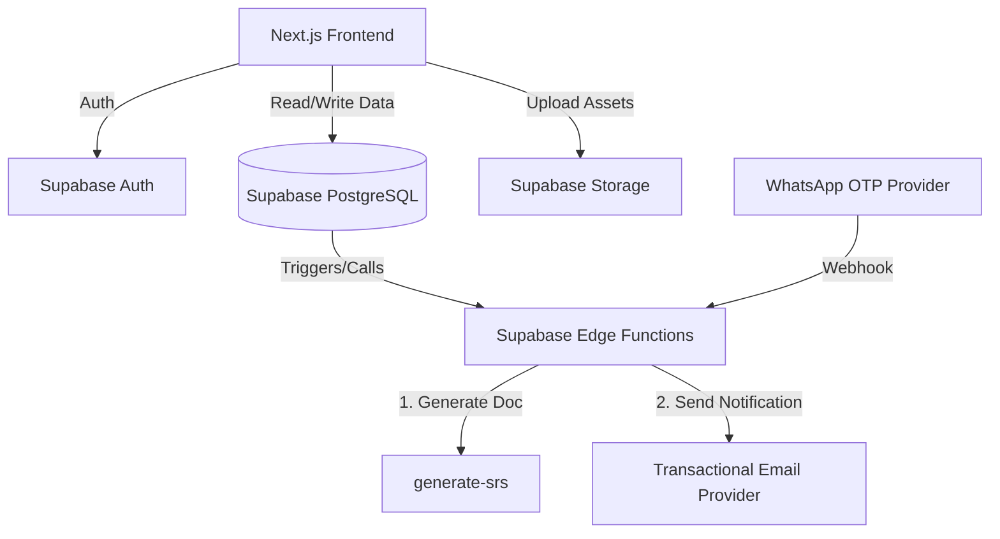

# DUKANZO - Phase 1 Master Implementation Specification

## 1. Project Identity & Purpose

**Name:** Dukanzo
**Brand Direction:** "Come Into Digital."

Dukanzo Phase 1 is a web development agency platform. The system allows potential customers to explore website service tiers, select a tier, authenticate using a mobile/WhatsApp OTP, configure options, provide requirements, and submit a project request. The Dukanzo team receives these requirements to build the website for the customer.

**Important Branding Rules:**
- Do NOT use "Dukaan", "Your Dukaan. Now Digital.", or any previous tagline.
- The brand should feel independent, modern, youthful, professional, human, Indian, and digital-first.
- Avoid corporate jargon or generic AI-generated marketing copy.
- This is an agency model where Dukanzo builds the website, not a self-serve builder.

## 2. Scope

### In Scope (Phase 1)
- Customer acquisition & service presentation
- Tier selection
- Requirement collection & SRS (Software Requirements Specification) generation
- Human assistance (Call Us)
- Project request submission
- Internal agency workflow notification

### Out of Scope (Phase 2 - DO NOT IMPLEMENT)
- Self-service website builder (drag-and-drop editor)
- Template marketplace
- Customer website dashboard
- Automated website generation & deployment
- SaaS subscriptions
- Multi-category product platform

## 3. Core Product Idea & User Flows

The central message is: *"You don't need to know how websites work. Tell us what you want, and we'll help you get it built."*

There are two primary customer paths:

### PATH A — Customer knows what they want
`Landing Page` → `Choose Tier` → `Authenticate` → `Configure Website` → `Answer Requirements` → `Review` → `Submit` → `Dukanzo Team Receives Request`

### PATH B — Customer does not know what they want
`Landing Page` → `Call Us` → `Human Conversation` → `Dukanzo Helps Define Requirements` → `Project Discussion`

> [!IMPORTANT]
> The user must never be forced to complete the questionnaire if they prefer talking to Dukanzo. "Call Us" must be a first-class feature accessible at all stages.

## 4. Brand & Visual Design

**Primary Theme:** YELLOW + WHITE
**Supporting Colors:** Dark charcoal, black/dark text, soft neutral backgrounds, subtle gray borders.

**Visual Priorities:**
- Strong typography (modern, Google Fonts).
- Large whitespace, clean grids.
- Real portfolio visuals and high-quality website mockups.
- Simple interaction patterns.
- Approximate balance: 70% white/light space, 20% dark typography/UI, 10% yellow accent.

**Avoid:** AI-generated looks, excessive gradients/glassmorphism, random 3D objects, fake statistics/testimonials, generic laptop stock images.

## 5. Frontend Architecture & Landing Page

**Stack:** Next.js, TypeScript, Tailwind CSS, shadcn/ui (customized), Lucide, React Hook Form, Zod.

### Directory Structure (Conceptual)
```text
src/
  app/
    page.tsx
    services/
    work/
    pricing/
    about/
    start/
    auth/
    configure/
    requirements/
    review/
    success/
  components/
    landing/
    tiers/
    auth/
    requirements/
    shared/
  lib/
  types/
  config/
```

### Landing Page Structure
A professional single-page agency website.
1. **Navbar:** Logo, Services, How It Works, Our Work, Pricing, About, CTA ("Get Started"). No dashboard/login links.
2. **Hero:** Strong headline ("Come Into Digital."), explanation of service, CTAs ("Build My Website", "See Our Work").
3. **Business Categories:** Highlighting target customers (local shops, tutors, tailors, electricians, etc.).
4. **What Dukanzo Provides:** Value proposition based on tiers (custom design, mobile-friendly, basic SEO, etc.).
5. **How It Works:** Simple 7-step flow from telling about the business to Dukanzo finalizing scope.
6. **Portfolio:** Real work or clearly labeled "Sample Concept". No fake content.
7. **Service Tiers:** Three strong cards (Basic, Standard, Premium).
8. **Why Dukanzo & FAQ.**
9. **Final CTA & Footer.**
10. **Persistent "Call Us" Action.**

## 6. Service Tier System

Prices and options must be dynamic and driven by configuration/database, not hardcoded conditionals.

### Tiers
- **TIER 1 — BASIC:** For a simple online presence (1-page, mobile responsive, basic info).
- **TIER 2 — STANDARD:** For larger websites (5+ pages, gallery, WhatsApp, Maps, Basic SEO).
- **TIER 3 — PREMIUM:** For complex/custom requirements (custom UI/UX, advanced integrations).

### Tier Card UX
Cards must show: Tier name, target audience, page scope, features, price/label, and a CTA (e.g., "Choose Basic", "Let's Talk").

## 7. Authentication

**Method:** MOBILE PHONE + WHATSAPP OTP.
**Provider:** Supabase Auth + WhatsApp OTP Provider (abstracted through an `AuthService`).

**Flow:**
1. User clicks a tier CTA.
2. Prompt: "Enter your WhatsApp number." -> Send OTP.
3. Prompt: "Verify your number." -> Enter OTP.
4. On success -> Authenticated session -> Tier configuration.

> [!NOTE]
> There is no traditional account system (no username/password, no profile pages). Authentication is purely to establish a verified session for project requests.

## 8. Guided Requirement Builder & Submission

The frontend UI for the questionnaire must be data-driven based on tier configuration.

### Steps
1. **Business:** Name, type, description, location.
2. **Customers:** Target audience, primary CTA (call, visit, buy).
3. **Website Structure:** Pages needed (filtered by tier).
4. **Design:** Style preferences or "I don't know — help me decide."
5. **Features:** Gallery, Maps, Forms (filtered by tier).
6. **Content/Assets:** Upload logos, images, text.
7. **Special Requirements:** Open-ended free-text field for all tiers.
8. **Review:** Final check of all answers before submission.

### UX Requirements
- **Progress:** Show step indicators (e.g., "Step 3 of 8").
- **State:** Preserve draft progress across reloads or navigation.
- **Mobile First:** Must work flawlessly on mobile (large touch targets, no horizontal scroll).
- **Call Us:** Persistent access in case they get stuck.

### Submission Flow
1. Verify auth & validate inputs/tier constraints on the server.
2. Generate request ID & persist to Supabase PostgreSQL.
3. Save canonical structured SRS data.
4. Trigger SRS document generation (PDF/DOCX/HTML).
5. Send email notification to Dukanzo team via transactional email provider.
6. Return success to user.

> [!WARNING]
> Do not trust frontend validation alone. The backend must enforce tier restrictions (e.g., rejecting Premium features on a Basic plan). If email sending fails, the project request must still be saved in the database.

## 9. Backend Architecture

**Stack:** Supabase (Auth, PostgreSQL, Storage, Edge Functions).

### Architecture Diagram


### Edge Functions (`supabase/functions/`)
Use only when required for secrets or custom logic:
- `submit-project-request`: Orchestrates validation, persistence, SRS trigger, and email.
- `generate-srs`: Creates the document representation from structured data.
- `send-project-email`: Interacts with the email provider (e.g., Resend).
- `whatsapp-webhook`: (Optional) If required by the OTP provider.

## 10. Data Models (PostgreSQL)

Ensure RLS (Row Level Security) is enabled. Customers can only view/edit their own requests.

- `customers`: Metadata linked to auth identity.
- `service_tiers`: id, name, slug, description, price, price_label, active, sort_order.
- `tier_options`: Options available per tier.
- `requirement_questions`: Data-driven questions (id, key, question, input_type, required, tier_scope).
- `requirement_question_options`: Available answers for select/radio questions.
- `project_requests`: id, request_reference, customer, tier_id, status (draft, submitted, etc.).
- `requirement_answers`: JSON/structured answers linked to request_id and question_id.
- `srs_documents`: Storage paths and metadata for generated documents.

## 11. Security & Error Handling

- **Secrets:** API keys (Email, Service Role, WhatsApp) must NEVER reach the frontend. Store in `.env` securely and access via server/Edge Functions.
- **RLS:** Strictly enforce row-level security.
- **Errors:** Show user-friendly errors ("That code isn't correct", "We couldn't submit your requirements right now"). Do not expose raw backend stack traces. Log technical details internally.

## 12. Deployment

- **Frontend:** Cloudflare Pages or Vercel.
- **Backend:** Supabase platform.
- **Database:** Supabase PostgreSQL.
- **Files:** Supabase Storage (validated for size, mime type).

## 13. Recommended Implementation Order

1. **Phase A (Project Foundation):** Setup Next.js, Tailwind, UI system, Supabase, Environments.
2. **Phase B (Database):** Tiers, Options, Questions, Requests, Answers, RLS.
3. **Phase C (Landing Page):** UI construction, Call Us component.
4. **Phase D (Auth):** WhatsApp OTP, phone input, session handling.
5. **Phase E (Tier Configuration):** Dynamic options, selection UI.
6. **Phase F (Requirement Builder):** Data-driven question rendering, progress, draft saving, file uploads.
7. **Phase G (Review):** Review page, edit flow.
8. **Phase H (Submission):** Edge function orchestration, canonical SRS data.
9. **Phase I (SRS):** Document generation and storage.
10. **Phase J (Email):** Transactional email integration, failure handling.
11. **Phase K (Quality):** Security, Accessibility, SEO, Performance.
12. **Phase L (Testing):** Unit, Integration, E2E.
13. **Phase M (Deployment):** Production rollout and verification.

## 14. Acceptance Criteria

1. Dukanzo landing page looks professional, non-AI-generated, utilizing the Yellow/White theme.
2. Three service tiers are presented clearly, and choices are data-driven.
3. Authentication via mobile/WhatsApp OTP works securely.
4. Questionnaire is dynamically rendered, preserves drafts, and is easy for non-technical users.
5. "Call Us" is accessible across the entire application.
6. Backend enforces tier constraints and input validation.
7. Project submission generates structured SRS data and sends an email to the team.
8. Email failure does not result in a lost database request.
9. RLS secures all customer data.
10. No Phase 2 functionality (builders, dashboards) is present.
11. Application works end-to-end on mobile devices.
